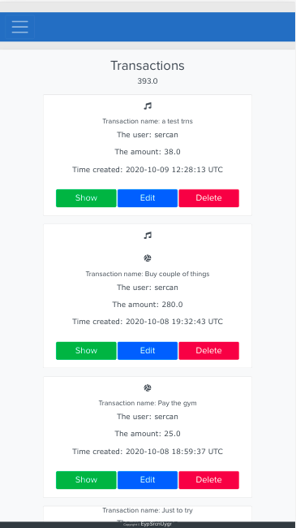

# Easy-Pay
This is a demo app for making some transactions depending on your choices. The project is a part of Microverse curriculum.<br>

<br>
<br>
<br>

## Built With
* Ruby
* Rails
* Rubocop
* Bootstrap
* RSpec

## Video Explanation

Here is the [video explanation]() of this project.

## Live Link

Here is the [live link](https://easy-pay-sercan.herokuapp.com/) of this project.

## Prerequisities

To get this project up and running locally, you must already have ruby installed on your computer.

## Getting Started

**To get this project set up on your local machine, follow these simple steps:**

**Step 1**<br>
Navigate through the local folder where you want to clone the repository and write<br>
``` git clone git@github.com:eypsrcnuygr/easy-pay-2.git```. It will clone the repo to your local folder.<br>
or with https<br>
```git clone https://github.com/eypsrcnuygr/easy-pay-2.git```.<br>
**Step 2**<br>
Run ```cd easy-pay-2```<br>
**Step 3**<br>
Run ```bundle install``` to get the necesary gems.<br>
**Step 4**<br>
Run ```rails db:create``` to create the database.<br>
**Step 5**<br>
Run ```rails db:migrate``` to make the migrations and ready your database.<br>
**Step6**<br>
Run ```yarn install --check files``` to verify your node modules.<br>
**Step7**<br>
Run ```rails s``` to run the server and go to 'http://localhost:3000/' at your browser.<br>
**Step8**<br>
Enjoy<br>

## Features

**1**<br>
From the home page you can sign up with name and password or with GitHub. <br>
**2**<br>
From the home page you can crete groups with the help of [Font Awesome](https://fontawesome.com/) and create transactions.<br>
**3**<br>
Your created groups will be selectable on new transaction form.<br>
**4**<br>
From your profile you can click all groups and check all the groups but you can't delete or edit which are not yours'.<br>
**5**<br>
You can see the transactions of all the groups from 'All Groups'. There you can see other's transactions as well, but can't manipulate them.<br> 
**6**<br>
You can see your all transactions from 'All Transactions'. You can edit or destroy them.<br>

## Test
- There are 33 tests in total.
- There are two folders, one is for unit tests which is '/spec/models' that is responsible to test 'group', 'transaction', 'user' models.
- '/spec/features' folder has 3 files that is responsible for 'users', 'transactions' and 'groups' actions.

## Authors

👤 **Eyüp Sercan UYGUR**

-   Github: [@eypsrcnuygr](https://github.com/eypsrcnuygr)
-   Twitter: [@eypsrcnuygr](https://twitter.com/eypsrcnuygr)
-   LinkedIn: [eypsrcnuygr](https://www.linkedin.com/in/eypsrcnuygr/)
-   Gmail: [sercanuygur@gmail.com](sercanuygur@gmail.com)

## 🤝 Contributing

Contributions, issues and feature requests are welcome!

## Show your support

Give a ⭐️ if you like this project!

## Issues

For issues [check](https://github.com/eypsrcnuygr/easy-pay-2/issues).

## Acknowledgments

-   This Project was part of an assignment available on Microverse.
-   Our thanks to Microverse and all our peers and colleagues there.

## 📝 License

This project is [MIT](lic.url) licensed.
